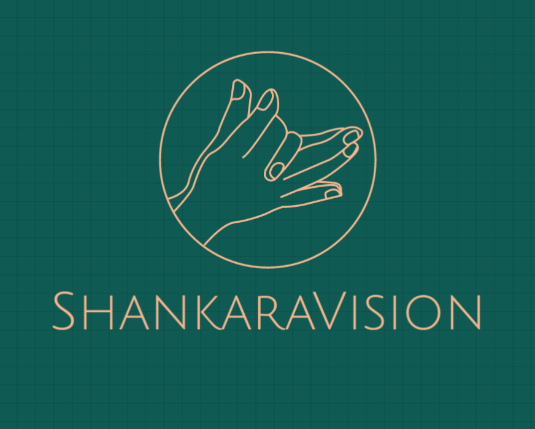
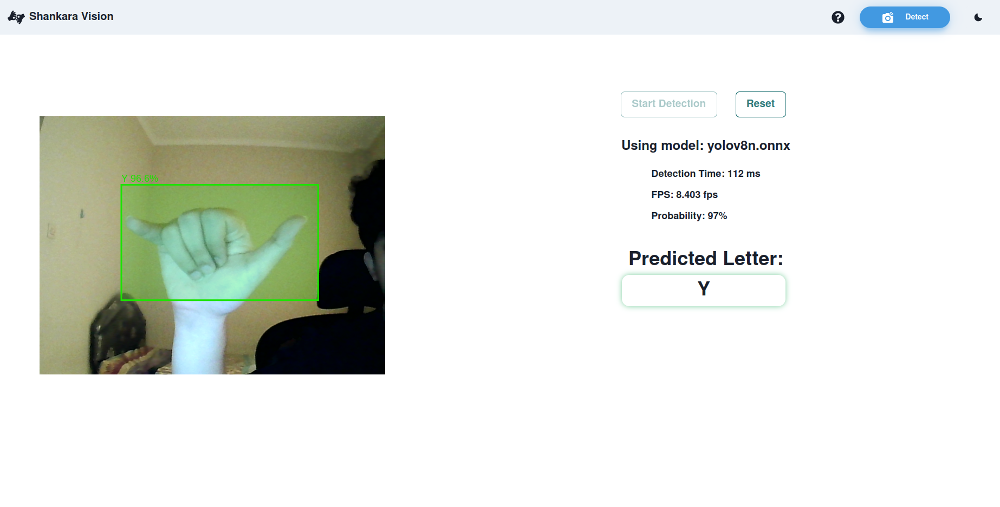

# Shankara Vision

  

Shankara Vision is an open-source application that helps people who have trouble with hearing using Sign Language.

## Overview

  

This app based on [American Sign Language(ASL)](https://www.nidcd.nih.gov/health/american-sign-language) and utilizes a Deep Convolutional Neural Network (CNN) to detect sign language. The app is deployed on a website platform. 

## Run It Locally
1. Clone this repository
2. Change directory to the cloned repo
3. Make sure [NodeJS(v18.17.1)](https://nodejs.org/en) and npm(9.6.7) is installed
4. Open your local terminal, run `npm install` for installing dependencies
5. Run the development server with `npm run dev`
6. Open [http://localhost:3000](http://localhost:3000) with your browser to see the result.

## Tech Stacks
- [Numpy](https://numpy.org/)
- [OpenCV](https://opencv.org/)
- [Pytorch](https://pytorch.org/)
- [YOLOv8 by Ultralytics](https://github.com/ultralytics/ultralytics)
- [React](https://react.dev/)
- [Next.js](https://nextjs.org/)
- [Chakra-UI](https://chakra-ui.com/)
- [ONNXRunTime](https://onnxruntime.ai/)

## Room for Improvement
- Use various datasets to enhance accuracy and performance
- Consider using a different CNN model alongside YOLOv8
- Enhance app performance through object tracking instead of object detection
- Explore development for other platforms such as Android or embedded devices (for ex: Raspberry Pi)

## Author
Team LATS(Look At The Stars)

